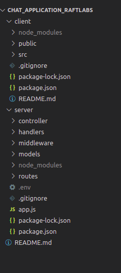
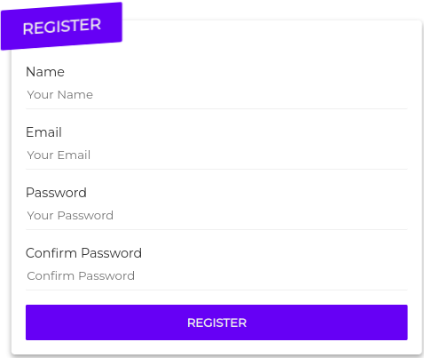
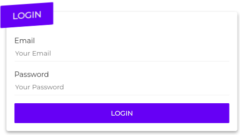
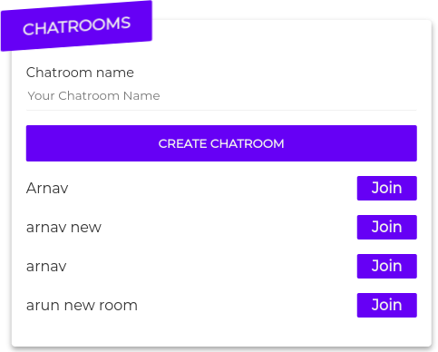
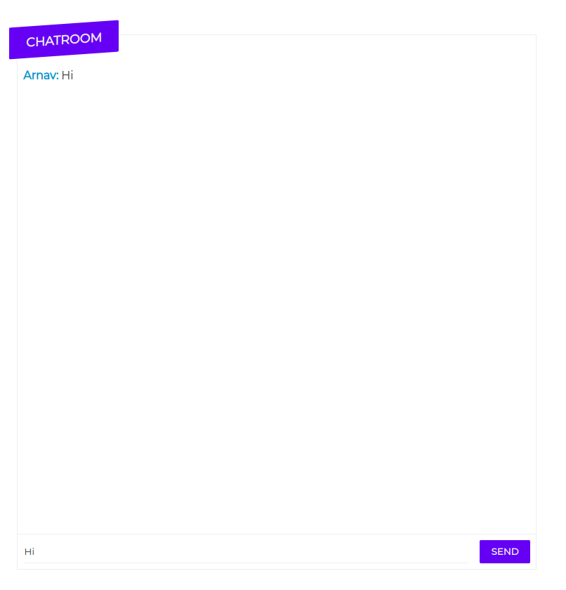

# RaftLabs

<p align="center">
  <h2 align="center">RaftLabs - Task 2 - Chat Application - Socket.io</h3>
</p>

<!-- TABLE OF CONTENTS -->

<details open="open">
  <summary>Table of Contents</summary>
  <ol>
    <li>
      <a href="#about-the-project">About The Project</a>
      <ul>
        <li><a href="#framework-used">Framework Used</a></li>
      </ul>
    </li>
    <li>
      <a href="#getting-started">Getting Started</a>
      <ul>
        <li><a href="#prerequisites">Prerequisites</a></li>
        <li><a href="#installation">Installation</a></li>
      </ul>
    </li>
    <li><a href="#usage">Usage</a></li>
  </ol>
</details>

<!-- ABOUT THE PROJECT -->

## About The Project

This project is built in **`node js`** with **`mongodb`** as backend and `b` as frontend. It provides following capability through API interface:

1. Authentication and authorization using JWT tokens.
2. Bidirectional communication between clients and servers using the Socket.IO library.
3. Broadcasting of messages to multiple clients using rooms or namespaces.
4. Integration with the existing RESTful API to enable real-time updates of resources.

The above API are using `jsonwebtoken` package for basic authentication to manage access

### Framework/Environment Used

Here are the major framworks/environment which were used in the project

- [Nodejs](https://nodejs.org/en/)
- [NPM package Manager](https://www.npmjs.com/)
- [Mongo DB
  ](https://www.mongodb.com/)

  In addition ReactJs library as well as Socket Io library were also used to create frontend side and the client-server connection for messaging.

<!-- GETTING STARTED -->

## Getting Started

The following sections helps in installing the project and the prerequisties required for the same.
The prerequisites and the installation guide are as follow:-

### Prerequisites

The local machine should have **Node js**, **Postman** and **MongoDB** installed

- npm
  ```sh
  npm install npm@latest -g
  ```
- postman
- mongodb

### Installation

1. Clone the repo

   ```sh
   git clone https://github.com/ArnavMahajan01/Raftlabs_Chat_Applications.git
   ```

2. Install NPM packages

   2.1 Server Side
   Go the **server** folder and run the command `npm install` to install the packages

   ```
   npm install
   ```

   2.2 Client Side
   Go the **client** folder and agian run the command `npm install` for necessary frontend packages

   ```
   npm install
   ```

3. Inside the server directory, make a `.env` file and inside the file enter the desired Port number, Mongoose cluster path and a auth token. Also add ENV = DEVELOPMENT

   ```
   DB_CONNECT = "YOUR PATH"
   PORT = "YOUR PORT"
   VERIFY_AUTH_TOKEN = "YOUR AUTH TOKEN"
   ENV = DEVELOPMENT
   ```

<!-- USAGE -->

## Usage

In this section, the structure and the project flow is described.

1. The chat application is divided into server and client side. For the proper communication and usage of socket.io frontend pages are also created along with API's. Inside the server directory, there is a _**`middleware`**_ folder along with _**`controller`**_, _**`routes`**_ and _**`models`**_. The `handler` directory contains the error for the application. The `middleware` contains all the necessary middlewares like auth. The `controller` and `routes` contains are responsible for handling incoming requests and returning responses to the client to a particular endpoint. The `models` contains the schemas for the mongodb. In the client directory, there is a folder **src** where the required pages and styles are created and implemented. A file named as **\*toaster.js** \*is used to implement the alert system. The `other` folder contains the images and walktrough video

   

2. Various API's are called which help in acheiving various function. Like `http://localhost:3000/register` helps in creating a new user and pushing the user's data into Mongoose. Similarly, `http://localhost:3000/chatroom`, `http://localhost:3000/chatroomGet` helps in creating and showing chatrooms respectively.
3. Output Snippets

   3.1 Register and Login

   
   

   3.2 Dashboard

   
   3.3 Chatroom
   
